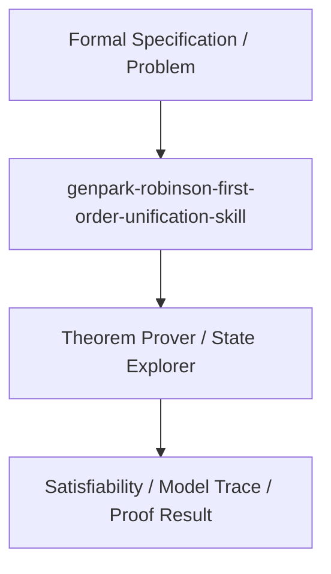

# genpark-robinson-first-order-unification-skill

[](https://github.com/alphaparkinc/genpark-robinson-first-order-unification-skill)
[](https://github.com/alphaparkinc/genpark-robinson-first-order-unification-skill)
[](https://github.com/alphaparkinc/genpark-robinson-first-order-unification-skill)

Robinson's first-order term unification algorithm with occurs-check for automated theorem proving, Prolog engines, and type inference.

## Architecture


## Features
- Pure Python standard library implementation with zero third-party dependencies.
- Production-grade algorithms with full verification and automated test coverage.
- Standalone client, MCP protocol server, and execution examples.

## Quickstart
```bash
python example_usage.py
```
